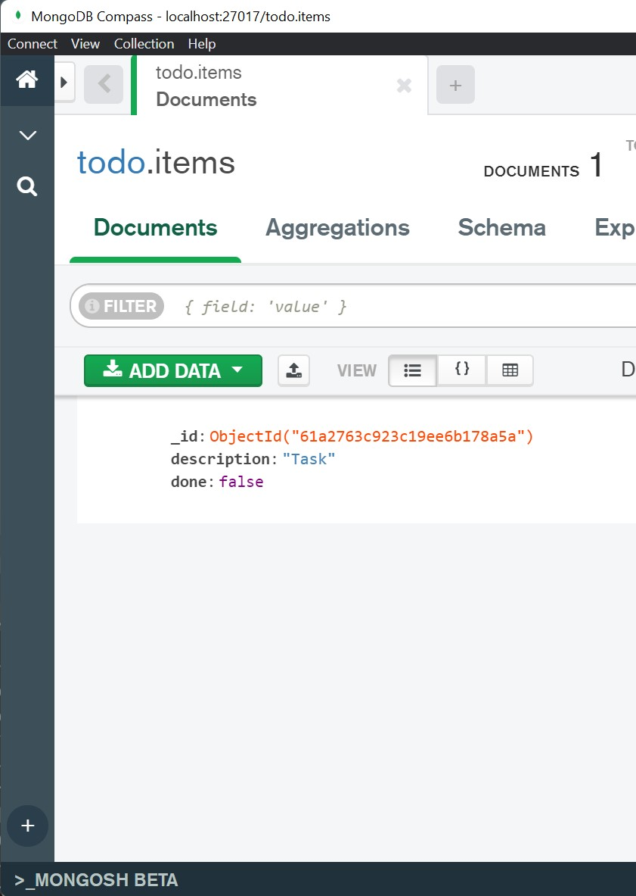
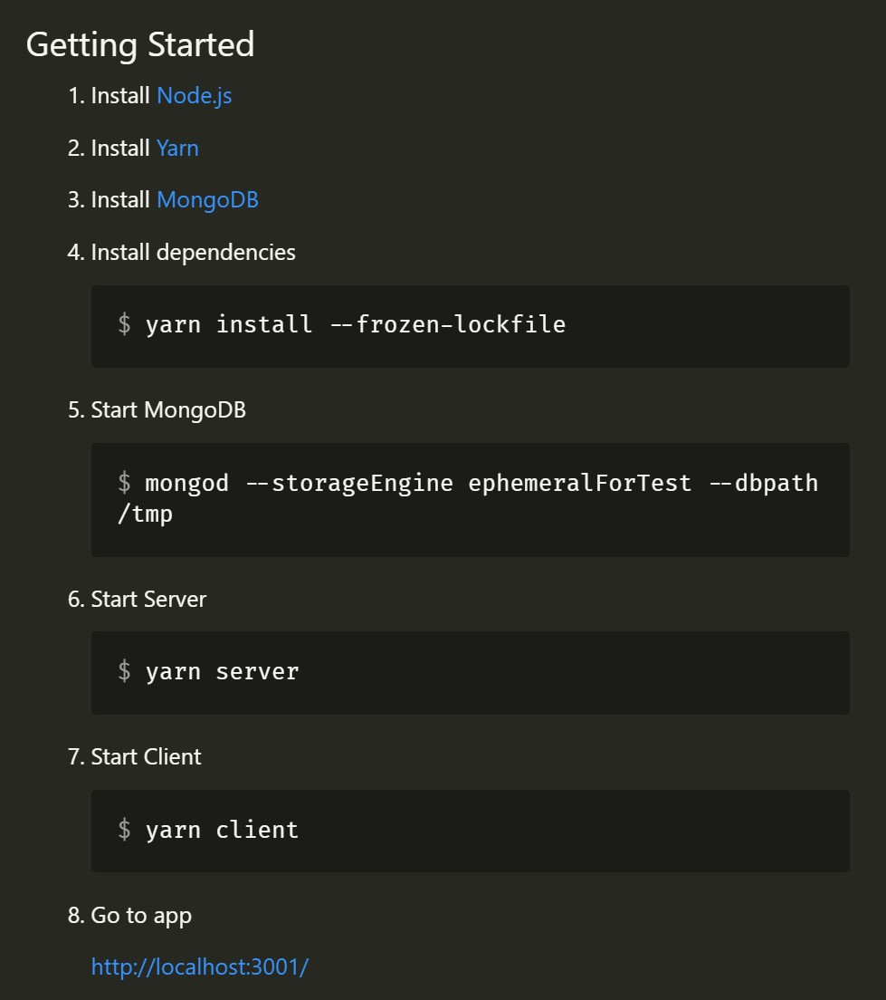

<!--

- Basic TODO API Example
    - MongoDB

- Hypochondriac View
    - Which version of Yarn did you use?
    - Which version of Node.js did you use?
    - What operating system are you using?
    - What architecture running on?
        - x64
        - x86_64
        - aarch64 (Apple M1)
    - Is Node.js in your path?
    - How is it installed are you managing it with nvm?
    - What does Node.js depend on?
        # Linux
        ```bash
        $ which node
        /home/joshua/.nvm/versions/node/v16.13.0/bin/node

        $ ldd /home/joshua/.nvm/versions/node/v16.13.0/bin/node
            linux-vdso.so.1 (0x00007ffc1773c000)
            libdl.so.2 => /lib/x86_64-linux-gnu/libdl.so.2 (0x00007f4aa8293000)
            libstdc++.so.6 => /lib/x86_64-linux-gnu/libstdc++.so.6 (0x00007f4aa80b2000)
            libm.so.6 => /lib/x86_64-linux-gnu/libm.so.6 (0x00007f4aa7f63000)
            libgcc_s.so.1 => /lib/x86_64-linux-gnu/libgcc_s.so.1 (0x00007f4aa7f48000)
            libpthread.so.0 => /lib/x86_64-linux-gnu/libpthread.so.0 (0x00007f4aa7f25000)
            libc.so.6 => /lib/x86_64-linux-gnu/libc.so.6 (0x00007f4aa7d33000)
            /lib64/ld-linux-x86-64.so.2 (0x00007f4aa82ac000)
        ```

        # Windows
        ```cmd
        C:\Users\Joshua>where node
        C:\Program Files\nodejs\node.exe

        C:\Users\Joshua>dumpbin /dependents "C:\Program Files\nodejs\node.exe"
        Microsoft (R) COFF/PE Dumper Version 14.29.30133.0
        Copyright (C) Microsoft Corporation.  All rights reserved.


        Dump of file C:\Program Files\nodejs\node.exe

        File Type: EXECUTABLE IMAGE

        Image has the following dependencies:

            dbghelp.dll
            WS2_32.dll
            IPHLPAPI.DLL
            PSAPI.DLL
            USERENV.dll
            ADVAPI32.dll
            USER32.dll
            CRYPT32.dll
            bcrypt.dll
            KERNEL32.dll
            WINMM.dll

        Summary

            2D9000 .data
            D0000 .pdata
            2647000 .rdata
            1D000 .reloc
            25000 .rsrc
            1118000 .text
                1000 _RDATA
        ```
    - Which version of libstdc++ is it using?
    - What NPM registry are you using? Just the default?
    - Which DNS server are you using?
    - What ISP are you using?
    - What's your internet speed like?

- You and your friend want to work on the project together.
    - He's a good developer but doesn't know how to Linux/Windows he wants to use what he's most familiar and productive with e.g. macOS.

- Enter Docker
    - ./assets/it-works-on-my-machine.jpg
    - We'll ship your file system*
    - Lets you target Kuberenetes as your deployment target.
        - You want Kubernetes because it makes scaling your application and infrastructure easy.

- Okay how to we Dockerize this application

    - Covers production use case, not development.
        - https://snyk.io/blog/10-best-practices-to-containerize-nodejs-web-applications-with-docker/
        - https://nodejs.org/en/docs/guides/nodejs-docker-webapp/
        - https://github.com/nodejs/docker-node/blob/main/docs/BestPractices.md
    - Covers development.
        - https://www.docker.com/blog/keep-nodejs-rockin-in-docker/

- Dockerfile
    - FROM node (nothing else)

Okay this works fine but where is our code?

Bind mount, okay we have our code.

Wait why doesn't our node_modules work?

- C++ addons
https://nodejs.org/api/addons.html

Although our code is JavaScript it like Node.js is dependent on Node modules which depend on C++ addons.

Often because there's something already written in C++ we want to make use of.

Or because the use case is computationally intensive (crypto) and needs to be as fast as possible.

- rm -rf node_modules
npm install

Wait this is really slow why?
- macOS

Okay well lets install it in the parent.

or try symlinking.

- Benefits of installing node_modules as part of the development image.

- We have to do it on the CI anyway so why not store these node_modules in a Docker image and use it as a cache.

- This means if our project has been tested and ran in the CI environment our only bottle neck is downloading the image

(no compilation or module resolution required)

We want to add a database.

- What is a Docker image?
    - It's just a tar archive with some magic around it.

- Dockerfile
    - Multi-stage builds

- Installing node_modules on host filesystem is slow on macOS, fine on Linux, meh on Windows.


# - Best Case Scenario
#
# So maybe you developing your application and hosting it on the same box.
#
# Questionable choice (for reasons I won't go into right now, but cool you do you).
#
# - Power cut at your house your application goes down and you loose market share and revenue because of it.
#
# Okay maybe having it on my home computer was a bad idea.
#
# Lets pack up my computer and send it to the nearest data center.
#
# They'll never have a power cut right?
#
# Nope, they're probably sensible have have things like Uninterruptible Power Supplies (UPS).
#
# Oh wait OVHcloud burns down, your server with it and any source code you have.
#
# https://www.reuters.com/article/us-france-ovh-fire-idUSKBN2B20NU
#
# Okay no worries we've backed up the server.
#
# Great, so now you find a new hosting provider and you redeploy your site.
#
# You repoint your DNS, great only 1 day of downtime.
#
# Maybe you even deploy it to a different server provider as well in advance for backup.
#
# A couple months later someone posts your application to Hacker News, and it gets upvoted to the top for a day.
#
# Suddenly your TODO app is a viral hit and on that same day same day your website is responding slower and slower to new visitors, until it stops responding all together.
#
# - https://www.forbes.com/sites/davidthier/2016/07/08/pokemon-go-servers-down-again/?sh=4dba14c229c9
# - https://www.vox.com/2016/7/16/12207552/pokemon-go-server-outage
#
# You phone up SuperCheapServers Inc. and request if you can rent some more servers in the rack.
#
# They come back with sorry we don't have any surplus servers at the moment but we can order some in might get here in 2-3 days?
#
# Not good enough, you want to catch the wave of good press coming your way?
#
# So where do you turn to next? The CLOUD!
#
# Now you are only an button press away from getting a new machine but you still have to setup unzip your project and set it up.
#
# Oh whoops turns out you missed the wave and now you're overpaying on servers when your demand doesn't match.
#
# Doing this setup and teardown is a pain lets automate it.
#
# So maybe you're using Ubuntu 20.04 to develop your application and deploying your application on a Ubuntu 20.04 EC2 instance in AWS?
#
# Maybe you're company mandates you use Ubuntu 20.04 everywhere including development environments.


-->


<!--

Welcome to my presentation on 'Docker for development'

-->

# <!-- fit --> Docker for development<br>:whale: :electric_plug: :technologist:

<style scoped>
section {
    text-align: center;
}
</style>

---

<!--

But first.

Let's cover why you might want to use Docker for your development environment.

Recently I went to a conference in Seattle and a I met a bunch of interesting people.

One person I met had developed a "cross platform" 2D game library, with basic examples and everything.

While at the airport I had a spare moment so I thought I'll download it, build it and run one of the examples.

So this is his documentation which I followed.

-->


<section style="overflow-y: scroll">
    
</section>

---

<!--

Once I had all the dependencies installed.

I ran the build script, and it compiled successfully (ignoring a few compiler warnings).

When it comes to running an example, you'll see it fails with a relatively informative error about failing to create a window.

So this is not a great experience as a developer.

Especially once who has not experience of the project.

I know a bit of C/C++ and maybe a bit of CMake, but do I know enough about GLFW to immediately know how to to fix this issue?

No!

-->

<script id="asciicast-S9s0ABJSdsP8uLjgcuAPQiStk" src="https://asciinema.org/a/S9s0ABJSdsP8uLjgcuAPQiStk.js" data-size="big" async></script>

<style scoped>
section {
    text-align: center;
}
</style>

---

<!--

Looking at this you might be thinking.

Well serves you right for using C.

This is why interpretted languages and JIT compilers exist.

So I can write once and run everywhere.

-->

# Lies!

```bash
joshua@diplodocus:~$ which node
/home/joshua/.nvm/versions/node/v16.13.0/bin/node

joshua@diplodocus:~$ ldd /home/joshua/.nvm/versions/node/v16.13.0/bin/node
        linux-vdso.so.1 (0x00007ffc5b77a000)
        libdl.so.2 => /lib/x86_64-linux-gnu/libdl.so.2 (0x00007fc070dc8000)
        libstdc++.so.6 => /lib/x86_64-linux-gnu/libstdc++.so.6 (0x00007fc070be7000)
        libm.so.6 => /lib/x86_64-linux-gnu/libm.so.6 (0x00007fc070a98000)
        libgcc_s.so.1 => /lib/x86_64-linux-gnu/libgcc_s.so.1 (0x00007fc070a7d000)
        libpthread.so.0 => /lib/x86_64-linux-gnu/libpthread.so.0 (0x00007fc070a5a000)
        libc.so.6 => /lib/x86_64-linux-gnu/libc.so.6 (0x00007fc070868000)
        /lib64/ld-linux-x86-64.so.2 (0x00007fc070de1000)
```

---


<style scoped>
section {
    text-align: center;
}
img {
    width: 100%;
}
</style>

---

<!--

So given most things have some dependency or another on the operating system.

How do we solve this issue in a way where we do not have to worry about the environment we are running in.

-->

# Winblows?

```powershell
C:\Users\Joshua>dumpbin /nologo /dependents "C:\Program Files\nodejs\node.exe"

Dump of file C:\Program Files\nodejs\node.exe

File Type: EXECUTABLE IMAGE

  Image has the following dependencies:

    dbghelp.dll
    WS2_32.dll
    IPHLPAPI.DLL
    PSAPI.DLL
    USERENV.dll
    ADVAPI32.dll
    USER32.dll
    CRYPT32.dll
    bcrypt.dll
    KERNEL32.dll
    WINMM.dll
```

---


# The promise of Docker

* Consistent _**runtime**_ environment
* Tools for developers
    * Docker Desktop
* Interoperable format (Docker Image)
* Self documenting (`Dockerfile`)
* Easy* to use APIs (CLI, HTTP API)
* Widely adopted
    * Kubernetes
    * GitHub Actions
    * EKS, AKS, GKE

<footer>
* Your mileage may vary
</footer>

---

# :stars: Humble beginnings

```bash
$ node --version # Node.js running on my host
v16.13.0

$ docker run --rm node --version # Node.js running in a container
v17.1.0

$ docker run --rm node:latest --version # <image>:<tag> the default tag is 'latest'
v17.1.0

$ docker run --rm node:16.13.0 --version # Specific Node.js running inside a container
v16.13.0

$ docker run --rm node which node # Location of Node.js binary inside the container
/usr/local/bin/node

$ docker run --rm node ldd /usr/local/bin/node # Dependencies of Node.js inside the container
        linux-vdso.so.1 (0x00007ffe80b9c000)
        libdl.so.2 => /lib/x86_64-linux-gnu/libdl.so.2 (0x00007f32df703000)
        libstdc++.so.6 => /usr/lib/x86_64-linux-gnu/libstdc++.so.6 (0x00007f32df536000)
        libm.so.6 => /lib/x86_64-linux-gnu/libm.so.6 (0x00007f32df3f2000)
        libgcc_s.so.1 => /lib/x86_64-linux-gnu/libgcc_s.so.1 (0x00007f32df3d8000)
        libpthread.so.0 => /lib/x86_64-linux-gnu/libpthread.so.0 (0x00007f32df3b6000)
        libc.so.6 => /lib/x86_64-linux-gnu/libc.so.6 (0x00007f32df1f1000)
        /lib64/ld-linux-x86-64.so.2 (0x00007f32df713000
```

---

# :rocket: Blast off!

```bash
$ docker run \    # Run a command in a new container
--rm \            # Automatically remove the container when it exits
--interactive \   # Keep STDIN open even if not attached *
--tty \           # Allocate a pseudo-TTY *
--workdir ~ \     # Working directory inside the container
--name dev \      # Assign a name to the container
node \            # Official Node Docker Image
bash              # Command

# Weird no files? 😕
root@f6513673f9f6:/home/joshua# ls -lah
total 8.0K
drwxr-xr-x 2 root root 4.0K Nov 25 18:10 .
drwxr-xr-x 1 root root 4.0K Nov 25 18:10 ..

# No vim either...
root@f6513673f9f6:/home/joshua# vim
bash: vim: command not found
```

---

# :muscle: Power through

```bash
root@f6513673f9f6:/home/joshua# mkdir todo
root@f6513673f9f6:/home/joshua# cd todo/

# Initialize a Node.js module
root@f6513673f9f6:/home/joshua/todo# yarn init --yes

# Write some code
root@f6513673f9f6:/home/joshua/todo# echo "console.log('Hello World! 🥳');" > index.js

# Write some MORE code!
root@f6513673f9f6:/home/joshua/todo# echo "console.log('Look mum no vim! 😯');" >> index.js

# Run the program
root@f6513673f9f6:/home/joshua/todo# node .
Hello World! 🥳
Look mum no vim! 😯
```

---

# :house_with_garden: Feels like home?

```bash
# echo is great but and the very least give me vim
root@f6513673f9f6:/home/joshua/todo# apt update
root@f6513673f9f6:/home/joshua/todo# apt install vim
root@f6513673f9f6:/home/joshua/todo# vim index.js
```


<style scoped>
p {
    text-align: center;
}
p > img {
    width: 50%;
}
</style>

---


<style scoped>
img {
    width: 70%;
}
p {
    text-align: center;
}
</style>

---

# :confounded: Happy now?

```bash
root@f6513673f9f6:/home/joshua/todo#

# Ctrl-p, Ctrl-q => Detach from container

$ docker ps
CONTAINER ID   IMAGE     COMMAND                  CREATED          STATUS          PORTS     NAMES
f6513673f9f6   node      "docker-entrypoint.s…"   13 minutes ago   Up 13 minutes             dev

# Copying files out of the container
$ docker cp dev:/home/joshua/todo .

$ tree
.
└── todo
    ├── index.js
    └── package.json

1 directory, 2 files

# The real work begins! (launches Visual Studio Code)
$ code todo
```

---

# :hourglass_flowing_sand: A few moments layer...

```bash
$ tree .
.
└── todo
    ├── package.json
    └── src
        └── main.js

2 directories, 2 files

$ cat todo/src/main.js
console.log('I hate index.js files 😡');

$ cat todo/package.json
{
  "name": "todo",
  "version": "1.0.0",
  "main": "src/main.js",
  "license": "MIT",
  "scripts": {
    "start": "node ."
  }
}

# Copying files to the container
$ docker cp ./todo dev:/home/joshua
```

---

# :wave: See you on the other side

```bash
$ docker attach dev

root@f6513673f9f6:/home/joshua/todo# ls -lah
total 20K
drwxr-xr-x 3 node node 4.0K Nov 25 19:09 .
drwxr-xr-x 3 root root 4.0K Nov 25 18:31 ..
-rw-r--r-- 1 node node  106 Nov 25 18:50 index.js # 😢 Why are you still here?
-rw-r--r-- 1 node node   96 Nov 25 19:06 package.json
drwxr-xr-x 2 node node 4.0K Nov 25 19:07 src

root@f6513673f9f6:/home/joshua/todo# rm index.js

root@f6513673f9f6:/home/joshua/todo# node .
I hate index.js files 😡

# I don't want to maintain and sync two copies of my code
# There must be a better way...
```

---

# :rescue_worker_helmet: Bind mount to the rescue!

```bash
$ pwd
/home/joshua/projects/joshua-barnett/docker-for-development/todo

$ docker run --rm --interactive --tty --workdir /srv/todo --name dev \
# ⭐ New mount argument
--mount type=bind,source=`pwd`,target=/srv/todo \
# 📝 Less verbose
# --volume `pwd`:/srv/todo
node \
bash

root@c9d70c16b644:/srv/todo# ls
package.json  src
```

- Only difference between them is `--mount` will throw an error if the host directory does not exist.
- Whereas `--volume` will stub a missing host directory for you.

---

# :smiling_imp: The devil is in the implementation

```bash
# 🍏 Outside the container + inside bind mount (Fast! 🐇)
$ wget -q --show-progress \
https://releases.ubuntu.com/20.04.3/ubuntu-20.04.3-desktop-amd64.iso
ubuntu-20.04.3-desktop   5%[=>          ] 157.30M  44.7MB/s    eta 64s

# 🍏 Inside the container + inside bind mount (Slow! 🐌)
root@c9d70c16b644:/srv/todo# wget -q --show-progress \
https://releases.ubuntu.com/20.04.3/ubuntu-20.04.3-desktop-amd64.iso
ubuntu-20.04.3-desktop   5%[=>          ] 150.88M  5.11MB/s    eta 9m 12s

# 🍏 Inside the container + outside bind mount (Fast-ish! 🐇)
root@c9d70c16b644:/tmp# wget -q --show-progress \
https://releases.ubuntu.com/20.04.3/ubuntu-20.04.3-desktop-amd64.iso
ubuntu-20.04.3-desktop   5%[>           ] 161.04M  40.6MB/s    eta 69s
```

---
# :seedling: Grass is greener?

```bash
# 🐧 Outside the container + inside bind mount (Fast! 🐇)
$ wget -q --show-progress \
https://releases.ubuntu.com/20.04.3/ubuntu-20.04.3-desktop-amd64.iso
ubuntu-20.04.3-desktop   5%[=>          ] 159.04M  45.1MB/s    eta 63s

# 🐧 Inside the container + inside bind mount (Fast! 🐇)
root@9e3d5e4532e2:/srv/todo# wget -q --show-progress \
https://releases.ubuntu.com/20.04.3/ubuntu-20.04.3-desktop-amd64.iso
ubuntu-20.04.3-desktop   5%[=>          ] 160.96M  43.0MB/s    eta 67s

# 🐧 Inside the container + outside bind mount (Fast! 🐇)
root@9e3d5e4532e2:/tmp# wget -q --show-progress \
https://releases.ubuntu.com/20.04.3/ubuntu-20.04.3-desktop-amd64.iso
ubuntu-20.04.3-desktop   5%[=>          ] 160.21M  45.4MB/s    eta 63s
```

---

<!--
I was going to go into more detail here about how you can access the Docker VM directly.

Explain a bit about how OverlayFS works, and other parts of how it is implemented on different platforms.

However, I don't think I've got enough time for that.

So I'll wave it away as magic for now.

But here's an article explaining a bit more about how it works.

Turns out sync file systems isn't just about moving and syncing files.

If you want things like hot reload to work you will also need to propagate and communicate file events between systems, so it gets quite complicated.

All your really need to know is bind mounts are great!

But you should pick when to use them wisely because they don't work great on all platforms and can be very slow in certain use cases.

Namely...

- Installation of node_modules
- Working directories for things like databases
-->

<iframe src="https://www.docker.com/blog/deep-dive-into-new-docker-desktop-filesharing-implementation/" alt="Deep Dive Into the New Docker Desktop filesharing Implementation Using FUSE"></iframe>

<!-- ```bash
$ docker inspect dev | jq '.[].GraphDriver.Data.MergedDir'
"/var/lib/docker/overlay2/100be0d438a58870743f604ae5fbe49f46a2b3d1a0cc02a7809171396fff1b10/merged"

# Enter Docker VM on macOS
$ nc -U ~/Library/Containers/com.docker.docker/Data/debug-shell.sock

# Inside Docker VM
$ cd /var/lib/docker/overlay2/100be0d438a58870743f604ae5fbe49f46a2b3d1a0cc02a7809171396fff1b10/merged
``` -->


<style scoped>
    section {
        padding: 0;
    }
    iframe {
        height: 100%;
    }
</style>

---

# :hole: It gets worse!

<!--
This problem with the bind mount implementation is exacerbated in I/O heavy use cases.

Such as database data directories and node_modules installation.
-->

```shell
# 🍏 Outside the container + inside bind mount (Fast! 🐇)
$ time yarn install --frozen-lockfile 
# -- snip ---
✨  Done in 50.21s.
4.85s user
23.67s system
96% cpu
50.398 total

# 🍏 Inside the container + inside bind mount (8x Slower! 🐌)
root@6001c575a574:/srv/awesome-todo# time yarn install --frozen-lockfile
# -- snip --
Done in 402.74s.

real    6m43.053s
user    1m15.429s
sys     1m10.757s

# Size on disk
root@6001c575a574:/srv/awesome-todo# du -sh node_modules packages/*/node_modules
370M    node_modules
0       packages/client/node_modules
0       packages/server/node_modules
```

---

# :thinking: How to handle `node_modules`?

* Use 🐧 Linux (VM etc.) for development
    * Not very inclusive 🤨
* Install `node_modules` outside of the bind mount directory
    * ❌ Makes `node_modules` inaccessible from the host
        * ✅ But they are visible through debuggers
    * Parent directory inside the container
        * `yarn install --frozen-lockfile --modules-folder ../node_modules`
        * ❌ Doesn't work if dependencies expecting to be in the project root (hardcoded)
    * Symlink to path outside of project directory
        * `node_modules -> /tmp/node_modules`
        * ⚠️ May still not work in some cases
    * Use a persistent Docker volume
        * If you want to use cached `node_modules` from an existing Docker image
        * ⚠️ Managing the volume becomes complicated

<style scoped>
    ul {
        font-size: .9em;
    }
</style>

---

# :books: Docker volumes

* ✅ No speed penalty like _**bind mounts**_
* ✅ Use cases
    * Backing up, restoring, migrating data
    * Intermediate file storage
    * Native file system behaviour
    * High performance I/O
        * e.g. Database directories
* ⚠️ Data not easily accessible from host
    * `docker cp` if necessary
* 📄 [Manage data in Docker](https://docs.docker.com/storage/)

---

# :open_book: Example use of a Docker volume

```bash
# Start a MongoDB container running in the background
$ docker run \
--rm \     # Automatically remove the container when it exits
--detach \ # Run container in background and print container ID
--volume my_db_data_volume:/data/db \
# Create a named volume called 'my_db_data_volume'
# Mount the named volume to the path '/data/db' in the container
--name my_db \ # Assign a name to the container
mongo # Use the latest official MongoDB image

# Show running containers
$ docker ps
CONTAINER ID   IMAGE     COMMAND                  CREATED          STATUS          PORTS       NAMES
a277c6f52683   mongo     "docker-entrypoint.s…"   3 minutes ago    Up 3 minutes    27017/tcp   my_db

# Execute a mongo shell (alongside the already running mongod)
$ docker exec --interactive --tty my_db mongo

> use todo
switched to db todo

> db.items.insert({"description": "Task", "done": false})
WriteResult({ "nInserted" : 1 })

> exit

$ docker rm --force my_db
my_db
```

---

```bash
# No containers running at the moment
$ docker ps --all
CONTAINER ID   IMAGE     COMMAND   CREATED   STATUS    PORTS     NAMES

# But our MongoDB data volume still exists
$ docker volume ls
DRIVER    VOLUME NAME
local     my_db_data_volume

# Start the container again with the same arguments
$ docker run \
--rm \
--detach \
--volume my_db_data_volume:/data/db \
--name my_db \
# This time lets also publish the MongoDB port to our host
--publish 27017:27017 \
mongo

# Query MongoDB via the shell for existing items
$ docker exec my_db \
mongo todo --quiet --eval 'db.items.find().forEach(printjson)'
{
        "_id" : ObjectId("61a27159b08ff2c5624a9bba"),
        "description" : "Task",
        "done" : false
}

# Can also use a GUI on our host 👉
```



---

# :spider_web: Docker networks

- Every container is assigned to the default `bridge` network.


    ```bash
    $ docker network ls
    NETWORK ID     NAME      DRIVER    SCOPE
    f56f0ebff9c0   bridge    bridge    local
    3aaf4000c115   host      host      local
    861adb658ac5   none      null      local
    ```

---

```json
$ docker inspect my_db | jq '.[].NetworkSettings.Networks'
{
    "bridge": {
        "IPAMConfig": null,
        "Links": null,
        "Aliases": null,
        "NetworkID": "f56f0ebff9c02f8c81a2cb4983740d70eae5f79968c49f282d3641a9fdea353e",
        "EndpointID": "4111d8d341b634e8851d5a37fe06773e37930e7d5dcd9d5ab1f075803f0e6838",
        "Gateway": "172.17.0.1",
        "IPAddress": "172.17.0.2",
        "IPPrefixLen": 16,
        "IPv6Gateway": "",
        "GlobalIPv6Address": "",
        "GlobalIPv6PrefixLen": 0,
        "MacAddress": "02:42:ac:11:00:02",
        "DriverOpts": null
    }
}
```

---

# :thumbsdown: Don't do this at home

```bash
# Creating a new 'client' container that will connect to 'my_db' through bridge
$ docker run --rm --name my_client --interactive --tty mongo bash

# Can't connect to 'my_db' container through 'localhost'.
root@63dcb850b14f:/# mongo todo --quiet --eval 'db.items.find().forEach(printjson)'
Error: could not connect to server 127.0.0.1:27017, connection attempt failed: SocketException:
Error connecting to 127.0.0.1:27017 :: caused by :: Connection refused :
connect@src/mongo/shell/mongo.js:372:17
@(connect):3:6
exception: connect failed
exiting with code 1

# ❌ Requires hardcoded IP address
root@63dcb850b14f:/# mongo mongodb://172.17.0.2:27017/todo --quiet --eval 'db.items.find().forEach(printjson)'
{
        "_id" : ObjectId("61a2763c923c19ee6b178a5a"),
        "description" : "Task",
        "done" : false
}
```

---

# :thumbsup: Recommended way

* Use `--network <name>` to create a user defined bridge network.
* User-defined bridges provide automatic DNS resolution between containers.
* User-defined bridges provide better isolation.
* Containers can be attached and detached from user-defined networks on the fly.


---

# :bridge_at_night: Building bridges

```shell
# Create a user defined bridge network
$ docker network create my_network
ec58fc0d1375c280e609adc5086fd67697f55a8a3bfbde69eaaff65d9035a1ad

$ docker network ls
docker network ls
NETWORK ID     NAME         DRIVER    SCOPE
f56f0ebff9c0   bridge       bridge    local
3aaf4000c115   host         host      local
ec58fc0d1375   my_network   bridge    local 😊
861adb658ac5   none         null      local

# Recreate database container with '--network'
docker run --rm --detach --volume my_db_data_volume:/data/db --name my_db --publish 27017:27017 \
--network my_network \ # ⭐ New
mongo

# Recreate client container with '--network'
docker run --rm --name my_client --interactive --tty \
--network my_network \ # ⭐ New
mongo \
bash
```

---

# :relieved: Much better

```
# Install dig for DNS querying
root@924e075a1b8c:/# apt update && apt install --yes dnsutils

# Query database container name 'my_db'
root@924e075a1b8c:/# dig +short my_db
172.19.0.2

# ✅ Connecting to database using hostname
root@63dcb850b14f:/# mongo mongodb://my_db:27017/todo --quiet --eval 'db.items.find().forEach(printjson)'
{
        "_id" : ObjectId("61a2763c923c19ee6b178a5a"),
        "description" : "Task",
        "done" : false
}
```

---

# :beach_umbrella: Example project `awesome-todo`

* Database
    * `mongod` - NoSQL database

* Backend application
    * `fastify` - Web framework
    * `mongoose` - Data models
    * `graphql` - API Schema
    * `mercurius` - GraphQL API

* Frontend application
    * `create-react-app` - Frontend boilerplate
    * `styled-components` - Minor styling tweaks
    * `@apollo/client` - GraphQL client

<style scoped>
    ul {
        font-size: 0.9em;
    }
</style>

---

# :page_facing_up: RTFM

* Vague... :weary:
    * Which version of Node.js? 
    * Which version of Yarn?
    * Which version of MongoDB?
* Not very future proof :warning:
    * Will these steps still work
    5+ years from now?
* What if port `3001` is taken?
    * How do I change it?
* Cross platform?
    * ...works on my machine :angry:



<!-- 
```bash
root@a89e35bc7589:/srv/paysite-frontend# time yarn install --frozen-lockfile
real    15m12.459s
user    3m2.007s
sys     2m52.669s

$ du -sh node_modules */node_modules
1.3G    node_modules
20M     ma/node_modules
136K    shared/node_modules
64M     tour/node_modules
```
-->


<!-- <iframe src="https://www.docker.com/blog/deep-dive-into-new-docker-desktop-filesharing-implementation/"></iframe> -->

<!-- <style scoped>
section {
    display: grid;
    grid-template-columns: 50% 50%;
    grid-template-rows: 20% 80%;
}

h1 {
    grid-column-end: span 2;
}
/* Wraps unordered lists into columns */
/* section > * {
    flex: 1 0 auto;
} */
</style> -->

<!--
So let's imagine you start a new project.

You've decided to make a TODO app, because the thousands of existing ones do not fit your specific needs.

In the begunning there's all this possibility space yet to be realized.

You might have a bunch of questions that you answered without even thinking twice about.
-->

<!-- <iframe src="http://localhost:3001/" title="Awesome TODO" height="100%"></iframe> -->

<!-- ```shell
$ yarn init
yarn init v1.22.17
question name (todo):
question version (1.0.0):
question description: Better than the rest?
question entry point (index.js): src/main.js
question repository url: ¯\_(ツ)_/¯
question author: Me
question license (MIT): WTFPL
question private: true
success Saved package.json
Done in 57.59s.

# --snip--
```

* Let's build a TODO app! ✅
* I'm a bullet point
 -->
